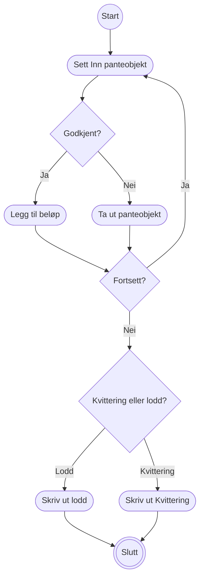

```mermaid

    flowchart TD;

        start((Start))

        settInn([Sett Inn panteobjekt])

        taUt([Ta ut panteobjekt])

        leggTilBelop([Legg til beløp])

        skrivUtLodd([Skriv ut lodd])

        skrivUtKvittering([Skriv ut Kvittering])

        godkjent{Godkjent?}

        fortsett{Fortsett?}

        ferdig{Kvittering eller lodd?}

        start --> settInn
        settInn --> godkjent

        godkjent --Ja--> leggTilBelop
        leggTilBelop --> fortsett

        godkjent --Nei--> taUt
        taUt --> fortsett

        fortsett --Ja--> settInn
        fortsett --Nei--> ferdig

        ferdig --Lodd--> skrivUtLodd
        ferdig --Kvittering--> skrivUtKvittering

        skrivUtLodd --> slutt
        skrivUtKvittering --> slutt


        slutt(((Slutt)))

```
